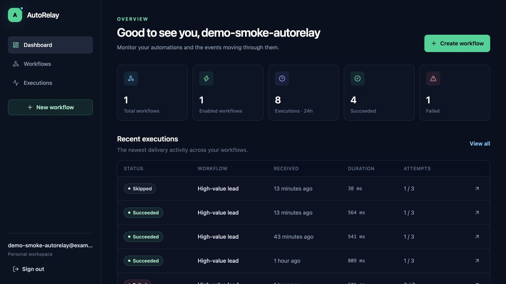
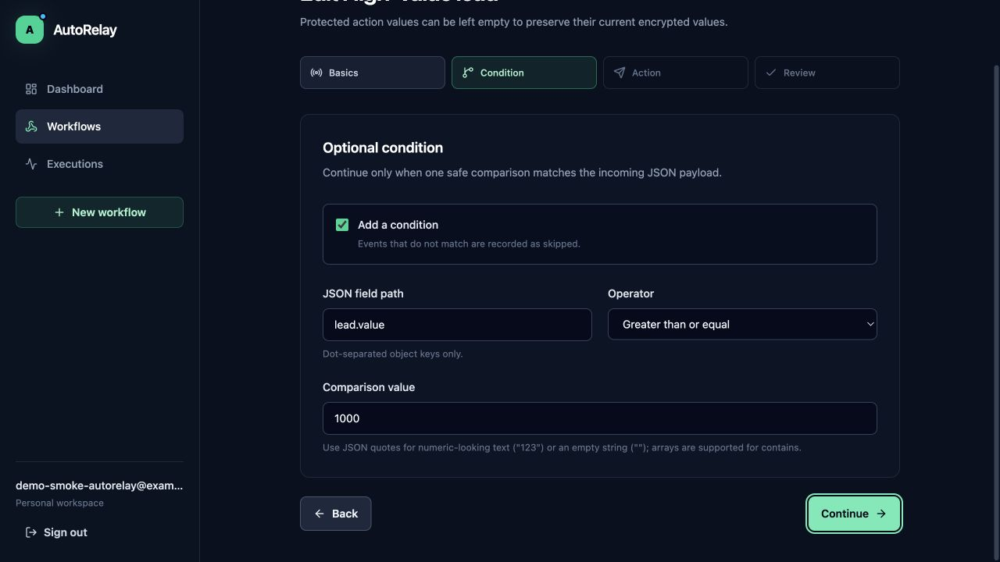
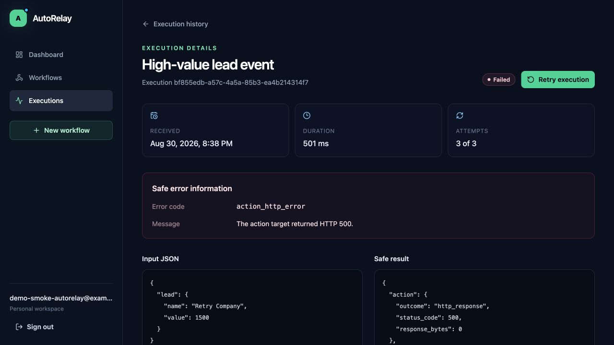
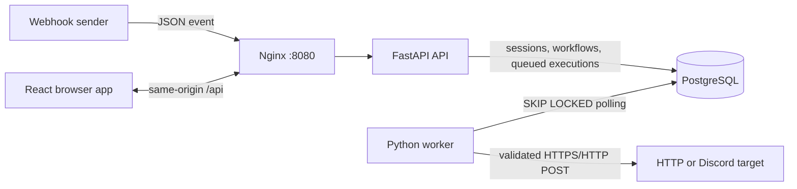

# AutoRelay
[](https://github.com/JakubLewosz/AutoRelay/actions/workflows/ci.yml)

Webhook-driven automation platform with conditional rules, PostgreSQL
execution history, background processing, and retryable HTTP and Discord
actions.

**Project status:** portfolio MVP for local evaluation. AutoRelay is not
presented as production-ready or formally security-audited, and there is no
public live deployment.

## Why this project exists

Small teams often need to turn an incoming event into one reliable outbound
action without operating a general-purpose workflow engine. AutoRelay explores
that problem with a deliberately constrained model: one incoming webhook, zero
or one condition, and exactly one action per workflow. The scope keeps the
interesting engineering visible—authentication, authorization, secret storage,
durable background work, retries, and safe outbound networking—without hiding
it behind a large orchestration framework.

## Core features

- Registration, login, logout, and persistent database-backed browser sessions.
- CSRF-protected owner operations and per-resource ownership checks.
- Workflow creation, editing, activation, deletion, and webhook-token rotation.
- Safe dot-path conditions with a fixed set of comparison operators.
- Generic HTTP POST and Discord webhook actions with encrypted configuration.
- JSON-only, size-limited webhook ingestion that returns quickly with HTTP 202.
- A separate PostgreSQL-polling worker with bounded retries and stale-run recovery.
- Filterable execution history, execution details, safe errors, and manual retry.
- Responsive React dashboard backed by the real API.
- Reproducible local startup with Docker Compose and automated CI checks.

## Demo workflow

Create a workflow named **High-value lead** with this condition:

```text
lead.value greater_than_or_equal 1000
```

Select either an HTTPS endpoint you control or a Discord webhook as its action,
enable the workflow, and copy the generated webhook URL. Then send the built-in
sample event:

```bash
python3 scripts/send_sample_event.py
```

The script requests the owner-only webhook URL through a hidden interactive
prompt. For non-interactive use, provide it through the
`AUTORELAY_WEBHOOK_URL` environment variable or pipe it through standard input;
the script deliberately rejects URL arguments so the token does not enter shell
history or the process argument list.

The script submits this payload without echoing the secret-bearing URL:

```json
{
  "lead": {
    "name": "Example Company",
    "value": 1500
  }
}
```

An equivalent cURL request can read its configuration from standard input,
keeping the URL out of cURL's argument list. First load the secret without
echoing it, then run:

```bash
read -r -s AUTORELAY_WEBHOOK_URL && export AUTORELAY_WEBHOOK_URL
curl --config - <<CURL_CONFIG
url = "$AUTORELAY_WEBHOOK_URL"
request = "POST"
header = "Content-Type: application/json"
data = "{\"lead\":{\"name\":\"Example Company\",\"value\":1500}}"
fail-with-body
CURL_CONFIG
unset AUTORELAY_WEBHOOK_URL
```

The public endpoint queues an execution; the worker evaluates the condition and
runs the configured action. Use `--lead-value 500` with the sample script to
observe a `skipped` execution. Treat the full webhook URL as a secret: do not
paste it into shared terminals, tickets, or logs.

## Screenshots

These screenshots were captured from the working local Docker Compose stack
with synthetic `example.com` demo data. No webhook token or action secret is
shown.







## Architecture



The API and worker are separate processes built from the same backend code. The
API persists queued work and never performs external workflow actions in the
public webhook request. PostgreSQL is both the system of record and the MVP job
queue; row locks allow workers to claim eligible records without adding Redis or
Celery. More detailed decisions are recorded in
[the architecture notes](docs/architecture.md).

## Security highlights

- Argon2 password hashes; plain-text passwords are never stored.
- Opaque session tokens stored only as hashes, with HttpOnly, SameSite=Lax cookies.
- Session-bound CSRF tokens for authenticated state-changing requests.
- Fernet encryption for recoverable webhook tokens and sensitive action settings.
- Immediate invalidation of an old webhook URL after token rotation.
- Owner scoping for private workflow and execution operations.
- SSRF checks for schemes, credentials, DNS results, and non-public IP ranges.
- Disabled outbound redirects, bounded timeouts, response truncation, and secret redaction.
- Request IDs and structured client errors without returned stack traces.

These controls reduce common risk; they are not a guarantee of production
security. Remaining risks and deployment assumptions are documented in
[the security guide](docs/security.md).

## Technology stack

**Backend:** Python 3.12, FastAPI, Pydantic 2, SQLAlchemy 2, Alembic,
PostgreSQL, asyncpg, httpx, argon2-cffi, cryptography, pytest, Ruff, and mypy.

**Frontend:** React, TypeScript, Vite, React Router, TanStack Query, React Hook
Form, Zod, Tailwind CSS, Vitest, Testing Library, and Playwright.

**Infrastructure:** Docker, Docker Compose, Nginx, and GitHub Actions.

## Repository structure

```text
AutoRelay/
├── backend/                  FastAPI API, domain services, worker, and migrations
├── frontend/                 React application, Nginx config, and browser tests
├── docs/                     Architecture, security, and portfolio notes
├── scripts/                  Environment bootstrap and sample webhook sender
├── .github/workflows/ci.yml  Backend, frontend, browser, and image checks
├── docker-compose.yml        PostgreSQL, API, worker, and frontend stack
└── .env.example              Documented non-secret configuration template
```

## Docker Compose setup

Prerequisites are Docker Engine/Desktop with Docker Compose and Python 3 for the
bootstrap script. From the repository root:

```bash
python3 scripts/bootstrap_env.py
docker compose up --build
```

The bootstrap script creates `.env` with random development secrets only when
the file does not already exist. It never overwrites an existing file or prints
the generated values. Compose starts PostgreSQL, applies Alembic migrations,
waits for API readiness, starts the worker, and exposes the complete application
at [http://localhost:8080](http://localhost:8080).

Useful endpoints:

- Application: [http://localhost:8080](http://localhost:8080)
- API documentation: [http://localhost:8080/api/docs](http://localhost:8080/api/docs)
- Liveness: [http://localhost:8080/api/health](http://localhost:8080/api/health)
- Readiness: [http://localhost:8080/api/ready](http://localhost:8080/api/ready)

Stop the processes while preserving PostgreSQL data with:

```bash
docker compose down
```

The named `postgres_data` volume retains users, workflows, and execution
history across ordinary container restarts.

## Development setup

The supported toolchain is Python 3.12, Node.js 22, npm, and PostgreSQL 16.
Generate `.env` once, then start only the database:

```bash
python3 scripts/bootstrap_env.py
docker compose up -d postgres
```

Create the backend environment and apply migrations from the repository root:

```bash
python3.12 -m venv .venv
source .venv/bin/activate
python -m pip install --upgrade pip
cd backend
python -m pip install -e '.[dev]'
cd ..
alembic -c backend/alembic.ini upgrade head
uvicorn app.main:app --app-dir backend --reload --host 127.0.0.1 --port 8000 --no-access-log
```

On PowerShell, activate the environment with
`.venv\Scripts\Activate.ps1`. Start the worker in a second activated terminal:

```bash
python -m app.worker.main
```

Start the frontend in a third terminal:

```bash
cd frontend
npm ci
npm run dev
```

Vite serves [http://localhost:5173](http://localhost:5173) and proxies `/api`
to the backend so browser cookies remain same-origin. `VITE_API_PROXY_TARGET`
can override the default backend target `http://localhost:8000`.

## Quality and test commands

With the Python environment active, run backend checks from `backend/`:

```bash
python -m ruff format --check .
python -m ruff check .
python -m mypy app
python -m pytest
```

Run frontend checks from `frontend/`:

```bash
npm ci
npm run lint
npm run format:check
npm run typecheck
npm test
npm run build
npx playwright install chromium
npm run test:e2e
```

Backend integration tests require a reachable PostgreSQL database. The GitHub
Actions workflow provisions an isolated PostgreSQL service and runs the same
format, lint, type, test, build, browser, and container validation commands.
The GitHub Actions workflow validates backend quality and PostgreSQL integration 
tests, frontend quality and production build checks, browser tests, Docker image builds, 
and the Docker Compose configuration.

Backend integration tests run against a real PostgreSQL service in CI. The Playwright 
suite validates the browser workflow with controlled API responses; it is not a full 
browser-to-worker end-to-end test of the complete stack.

## API

Application routes use the `/api/v1` prefix. They cover authentication,
workflow management, token rotation, test events, execution history, manual
retry, and public webhook ingestion. With the API running, OpenAPI and Swagger
UI are available at `/api/openapi.json` and `/api/docs` respectively.

Operational probes are intentionally outside the versioned application API:
`GET /api/health` reports process liveness and `GET /api/ready` verifies that
the database can be reached.

## Current limitations

- A workflow supports at most one condition and exactly one action.
- PostgreSQL polling is suitable for this portfolio MVP, not a high-scale distributed queue.
- Delivery is at-least-once around failures; exactly-once action delivery is not guaranteed.
- There is no distributed rate limiter, email verification, or password-reset flow.
- SSRF validation cannot fully eliminate DNS-rebinding and network-layer race conditions.
- Reliability ultimately depends on the external action target.
- Queued attempts use the workflow configuration that is current when the worker
  claims them; editing or disabling a workflow does not cancel already accepted events.
- Secrets use one application-level Fernet key; managed key rotation is not implemented.
- The project has no public hosted demo and no selected software license yet.

See [ROADMAP.md](ROADMAP.md) for possible extensions. Those items are not part
of the current MVP.

## Development-process disclosure

OpenAI Codex was used as an implementation assistant for planning, coding,
testing, and documentation. Architectural constraints, security boundaries,
scope, and final review remain the project owner's responsibility. AutoRelay
does not call an LLM or any AI service at runtime.

Additional portfolio-ready copy and interview notes are in
[docs/portfolio-entry.md](docs/portfolio-entry.md).
