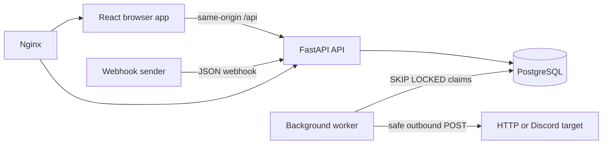

# AutoRelay architecture

## System overview

AutoRelay is a deliberately small modular monolith with two Python process
types and one browser application. FastAPI exposes owner and public webhook
routes. A separate worker imports the same service layer and polls PostgreSQL.
The React single-page application uses same-origin `/api` requests through
Vite in development and Nginx in the production-style container.

## Decisions

### Repository and processes

- A monorepo keeps API, worker, UI, deployment, and documentation versioned together.
- The API and worker share domain and persistence code but run as separate processes.
- PostgreSQL is both the source of truth and the MVP work queue. Row locking
  prevents duplicate concurrent claims; this is not presented as a high-scale queue.

### Authentication

- Opaque, random session tokens are hashed with SHA-256 before persistence.
- The raw token is sent only as an HttpOnly, SameSite=Lax cookie. Secure mode is environment-controlled.
- A second random CSRF value is associated with the session by hash and returned
  only to the authenticated owner; mutations require it in `X-CSRF-Token`.
- Passwords are hashed with Argon2 using `argon2-cffi`.

### Secrets

- Fernet encrypts recoverable webhook tokens and sensitive action configuration.
- SHA-256 hashes permit webhook-token verification without decrypting the stored copy.
- Owner responses contain a redacted action configuration. A blank secret on edit
  means preserve the stored value.

### Conditions and templates

- Dot paths traverse JSON objects only. The operator is selected from a fixed enum.
- No arbitrary expression language, dynamic code, `eval`, or raw HTML rendering is used.
- Discord templates support bounded `{{ dotted.path }}` substitutions only.

### Outbound networking

- Only HTTP(S) URLs without embedded credentials are accepted.
- Host resolution blocks non-global addresses by default. The explicit
  development/test override permits only loopback, RFC 1918, and IPv6 ULA
  targets; link-local, multicast, reserved, unspecified, and CGNAT addresses
  remain blocked.
- Redirects are disabled and timeouts are bounded. DNS can still change between
  validation and connection; this remaining rebinding risk is documented.

### API and client

- `/api/v1` is the versioned application API; `/api/health` and `/api/ready` are operational endpoints.
- Consistent structured errors include a request ID but never a stack trace.
- TanStack Query owns server state, while React Hook Form and Zod provide client usability checks.
- Backend validation and authorization remain authoritative.

### Deployment

- Docker Compose runs PostgreSQL, API, worker, and Nginx/frontend.
- API startup applies Alembic migrations before Uvicorn begins serving.
- A named volume retains PostgreSQL data; secrets are injected from `.env` and never baked into images.
